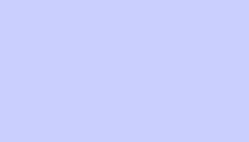
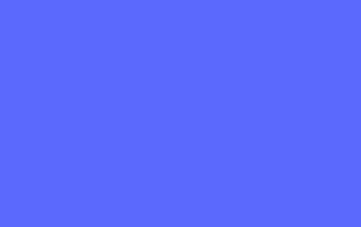
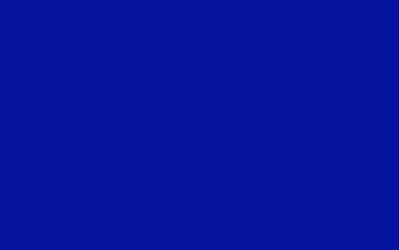
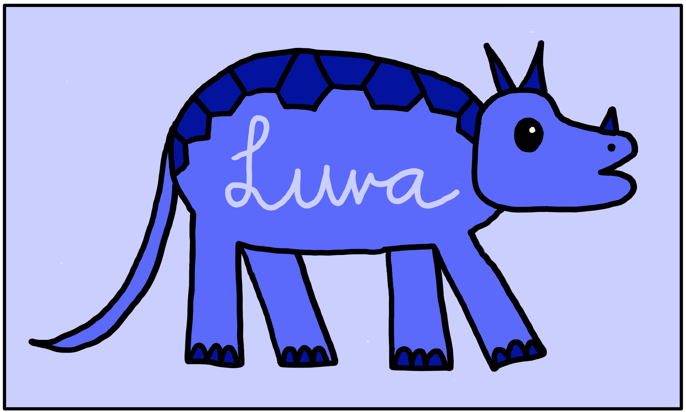

# Styleguide

## Allgemein
Es wurde bei der Seite sehr darauf geachtet, dass mit relativen Grössen (rem, em, vh, vw usw.) gearbeitet wird, um die Website möglichst dynamisch an verschiedene Geräte und Grössen anpassen zu können. Zudem ist es farblich ein eher schlichtes Design, damit es mit dem Bild im Hintergrund zusammen kein zu grosses Chaos gibt, sondern immer noch ordentlich wirkt.

## Farben
Die Website wird allgemein eher schlicht und mit wenigen Farben gestaltet. Ausser den diversen Violetttönen welche hier aufgelistet sind, wurden noch schwarz und weiss verwendet.
Die Violettöne:
* Hellviolett: #CACFFE 
* Mittelviolett: #5B6AFB 
* Dunkelviolett: #04139E 

## Hintergrund
Die Website hat jeweils einen Rand, welcher mit einem Bildhintergrund gefüllt ist. Dabei ist dieser für jede der Unterseiten gleich gross; die einzige Ausnahme bildet das Login und das Passwort-Reset, da diese nicht nur rechts und links, sondern auch oben und unten einen Rand haben.

## Schrift
Die Grundsätzlich normale Schriftgrösse wurde auf 1.5rem gesetzt, um die Website möglichst etwas inklusiver und lesbarer zu gestalten. Auch für Menschen, welche zu einem gewissen Grad schwierigkeiten mit der Sicht oder dem Erkennen kleiner Texte haben. Anschliessend wurden die anderen Schriftgrössen gesetzt (welche die 1.5rem der "normalen Schriftgrösse" als Standard für ihr 1 interpretieren). Es gilt:
* h1 = 2.5rem
* h2 = 1.8rem
* h3 = 1.3rem

Zudem wurden Klassen erstellt, um gewisse Textteile hervorheben zu können, ohne dies direkt im HTML machen zu müssen. Diese sind:
* bold: macht die Schrift dick und etwas grösser (1.3rem)
* italic: macht die Schrift kursiv
* subtext: macht die Schrift heller und etwas kleiner (0.8rem)

Der Text ist auf allen Seiten (ausser bei den Formularen - dort ist er mittig) linksbündig.

## Logo
Das Logo wurde von mir selbst in den Farben, welche oben definiert sind, designt. Es steht mit LuRa für LunaRaven, mein Pseudonym auf Github. Darauf abgebildet ist (wie auf dem Hintergrund) ein Dinosaurier, da ich gerne Dinosaurier habe und die ganze Website etwas Dinosaurierthemed machen wollte.
Hier noch als Bild:

## Abstände
Die Abstände innerhalb einzelner Container (padding) betragen grundsätzlich 2em. Der Zeilenabstand zwischen dem normalen Text beträgt 1.5em, damit er noch besser lesbar ist und optisch weniger zusammenklebt. Margins wurden grösstenteils vermieden und betrugen maximal 1em oder -1em, um Objekte etwas weiter von anderen Objekten zu entfernen.

## Header und Footer
Der Header und der Footer sind ebenfalls recht schlicht gehalten mit weissem Text auf dunkelviolettem Hintergrund (für genaue Farbangaben siehe [Farben](#farben)) und einer Höhe von 15vh. Es wurde überlegt, diese zu fixieren; jedoch würden sie dann einen zu grossen Teil des Bildschirms einnehmen. Deshalb wurden sie bewusst im Scrollflow gelassen.