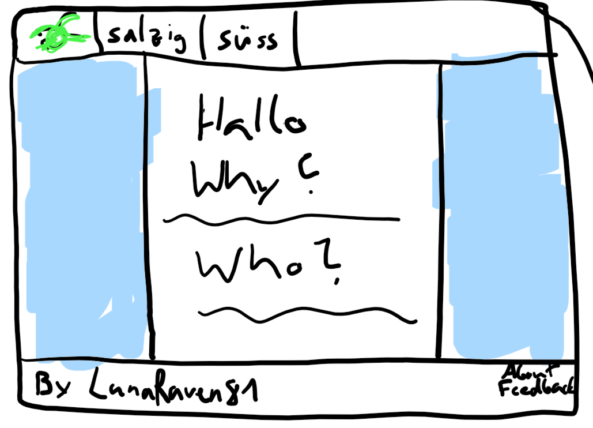
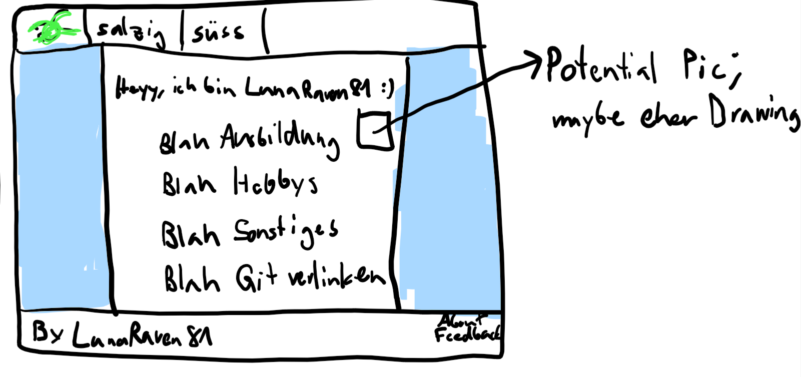
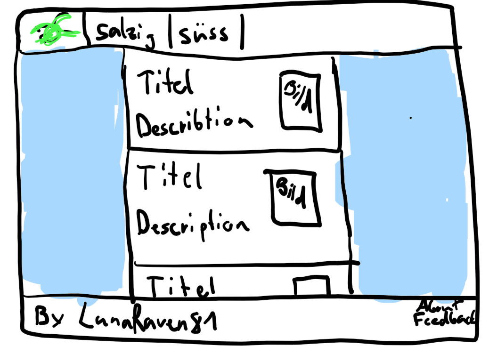
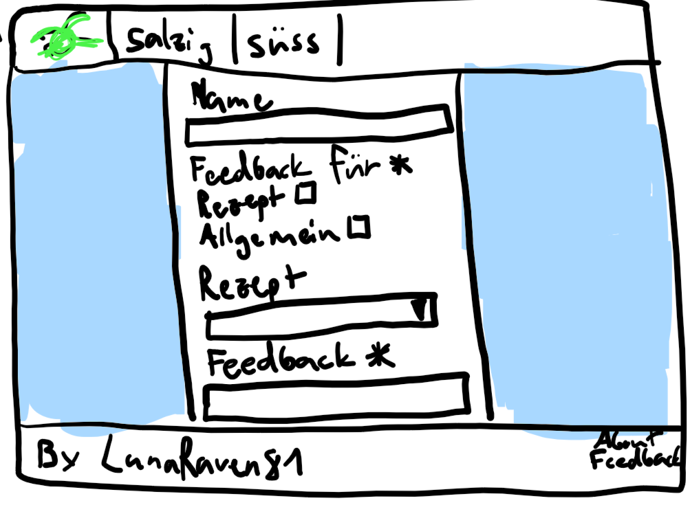
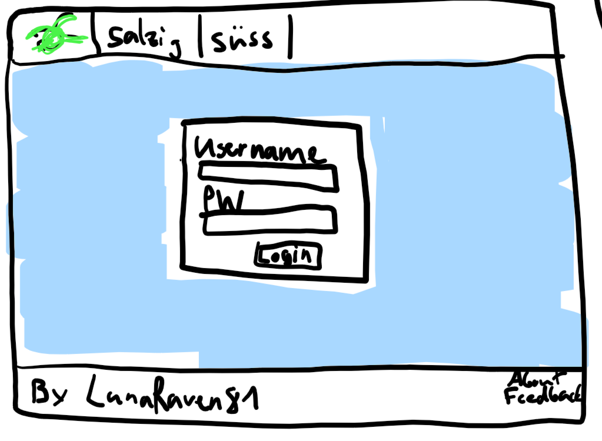
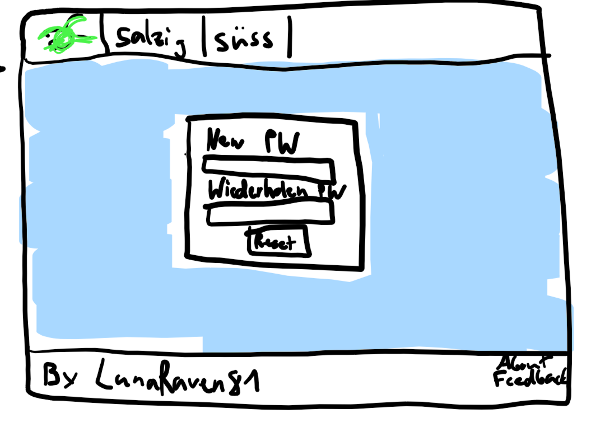

# Wireframes

## Erklärungen
Bei meinen Wireframes soll das grüne Gekrabbel jeweils das Logo darstellen. Alles, was blau markiert ist, wird auf der Website mit einem Hintergrundbild befüllt.

## Index.html

## About.html

## Hauptmahlzeit.html

## Feedback.html

## Login.html

## Password-Forgot.html

